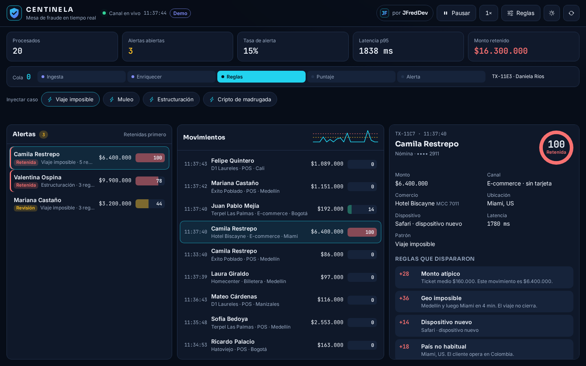
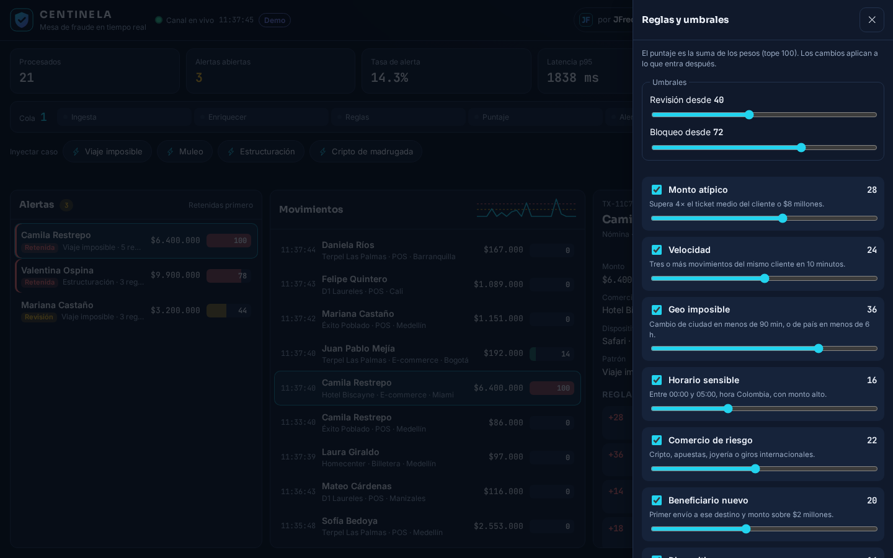
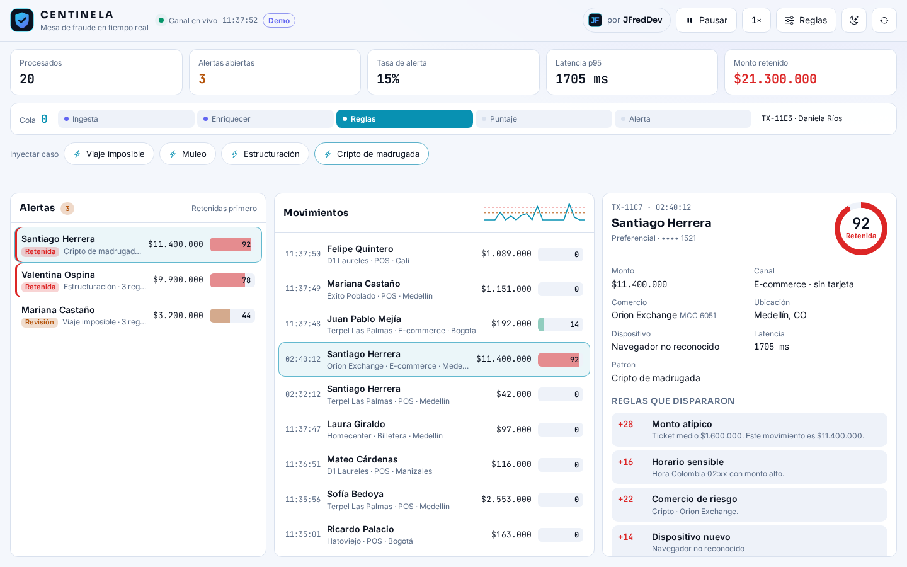
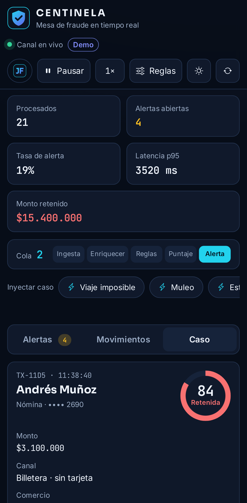
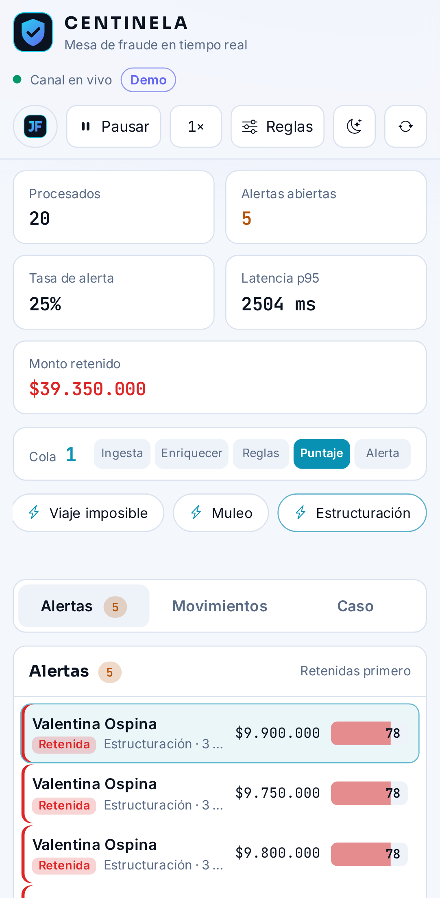

# CENTINELA

**Detección de fraude en tiempo real.** Cada movimiento entra a una cola. Un worker lo enriquece, evalúa 10 reglas y calcula un puntaje de riesgo de 0 a 100. Si pasa el umbral, la alerta llega a la mesa del analista, que la libera, confirma el bloqueo o la escala.

**[Probar la demo →](https://jfredmc.github.io/centinela/)** · corre entera en tu navegador, sin registro.



## Qué probar

1. **Inyectar caso**: viaje imposible, muleo, estructuración o cripto de madrugada. Mira cómo cruza las 5 etapas del pipeline y aparece en **Alertas**.
2. Abre la alerta: cada regla que disparó trae su peso y la evidencia.
3. **Liberar**, **Confirmar bloqueo** o **Escalar**.
4. En **Reglas**, apaga reglas o cambia pesos y umbrales. Aplica a lo que entra después y queda guardado.
5. **4×** acelera la ingesta; **Pausar** corta la entrada y el worker termina lo que ya está en la cola.

Umbrales de fábrica: revisión desde 40, bloqueo desde 72. El puntaje es la suma de los pesos, con tope 100.

| Reglas y umbrales                                            | Tema claro                                        | Móvil                                                                                                         |
| ------------------------------------------------------------ | ------------------------------------------------- | ------------------------------------------------------------------------------------------------------------- |
|  |  |   |

## Reglas

| Regla              | Dispara cuando                                              | Peso |
| ------------------ | ----------------------------------------------------------- | ---: |
| Monto atípico      | Supera 4× el ticket medio del cliente o $8 millones         |   28 |
| Velocidad          | Tres o más movimientos del mismo cliente en 10 minutos      |   24 |
| Geo imposible      | Otra ciudad en menos de 90 min, u otro país en menos de 6 h |   36 |
| Horario sensible   | 00:00–05:00 hora Colombia con monto alto                    |   16 |
| Comercio de riesgo | Cripto, apuestas, joyería o giros internacionales           |   22 |
| Beneficiario nuevo | Primer envío a ese destino por más de $2 millones           |   20 |
| Dispositivo nuevo  | Huella que el cliente no había usado                        |   14 |
| País no habitual   | El movimiento no se origina en Colombia                     |   18 |
| Estructuración     | Monto redondo justo bajo el umbral interno de $10 millones  |   30 |
| No presente        | E-commerce o billetera sin tarjeta presente y monto alto    |   12 |

Clientes, comercios y montos son ficticios.

## Arquitectura

```
packages/fraud-engine   Motor puro en TypeScript: reglas, puntaje, perfiles, escenarios y la mesa
                        como máquina de estados serializable. Sin dependencias. Lo usan los dos lados.
apps/web                Consola Angular 22 (zoneless, signals). Modo demo o modo API.
apps/api                NestJS 11 + BullMQ (Redis) + Socket.IO.
```

- **Modo demo** (GitHub Pages): la mesa corre en un **Web Worker** con el mismo motor y se guarda en `localStorage`. Si recargas, sigue donde ibas; **Reiniciar** la deja de fábrica.
- **Modo API**: el productor encola movimientos en **BullMQ**; los escenarios entran con prioridad alta. El `ScoringProcessor` (worker, concurrencia 1) los pasa por las etapas y los puntúa. La consola recibe el estado por **Socket.IO** (`/desk`, máximo cada 120 ms) y envía acciones validadas con `parseDeskAction`, con límite por conexión.
- La consola solo conoce `DeskStore`; `DemoDeskStore` y `ApiDeskStore` son intercambiables. El selector **Demo / API** aparece cuando el build tiene `apiUrl` (en `ng serve`, `http://localhost:3000`).

API REST: `GET /api/health`, `GET /api/desk`, `GET /api/desk/kpis`, `POST /api/desk/actions`.

## Desarrollo

Requisitos: Node 22, pnpm 10 (`corepack enable`), Docker para el backend.

```bash
pnpm install
pnpm --filter @centinela/fraud-engine build

# Solo la consola en modo demo
pnpm --filter @centinela/web start            # http://localhost:4200

# Backend real (Redis + API) y consola en modo API
cp .env.example .env
docker compose up -d --build                  # API en http://localhost:3000/api
pnpm --filter @centinela/web start            # http://localhost:4200/?mode=api
```

## Calidad

```bash
pnpm lint && pnpm typecheck && pnpm test      # motor (Vitest), web (Vitest), API (Jest)
pnpm --filter @centinela/api test:e2e         # contra Redis real
pnpm --filter @centinela/web build:pages && pnpm --filter @centinela/web e2e   # Playwright, escritorio + móvil
E2E_BASE_URL=https://jfredmc.github.io/centinela/ pnpm --filter @centinela/web e2e   # contra el sitio en vivo
```

CI corre formato, lint, tipos, tests, build, e2e de la API con Redis, un smoke test de Docker Compose y Playwright sobre el build de Pages. Después de cada despliegue, Playwright vuelve a correr contra el sitio en vivo.

## Licencia

MIT · Hecho por [JFredDev](https://jfredmc.github.io/portfolio/) (Jhon Maquilon).
